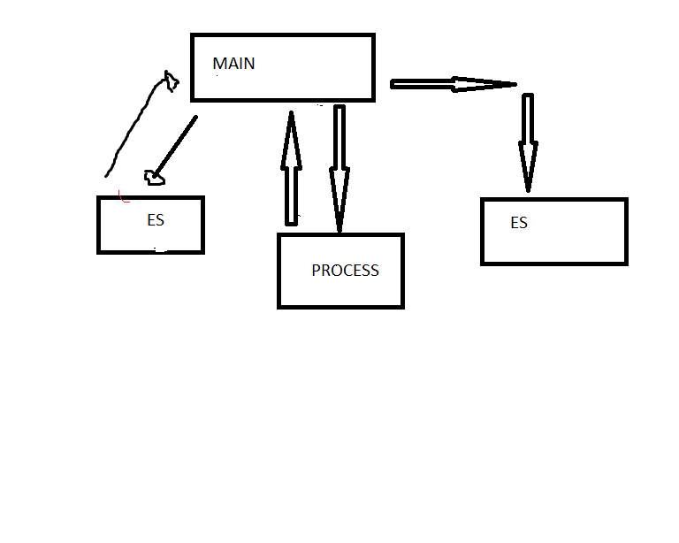

# Projeto de Arquitetura

Este aplicativo será desenvolvido utilizando programação orientada a objetos.

Nesse projeto, o software começara com a função Main, que chamará a função ES (processamento de entrada).
Após isso, ocorrerá o processamento dos dados inclúidos.
Pra finalizar se chamará a função ES para realizar a saída de dados.

Nesse modelo irão conter dados básicos sobre uma ação da empresa.

Existirão algumas funcionalidades de negociação e a leitura de atributos.