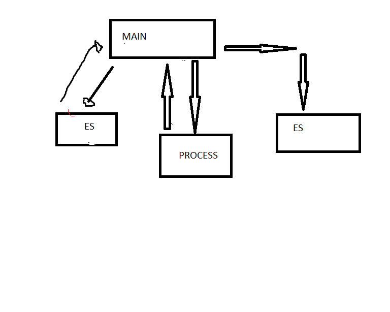

# Projeto de Arquitetura

Módulo de entrada de dados, processamento dos dados, para após retornar a saída.

Uma função impressora que imprime na tela o objeto.

Uma função de leitura de coeficientes, caaso escolha função afim ou quadrática.

Modelo de processamento: Receberá os coeficientes e determinará a área do gráfico.

