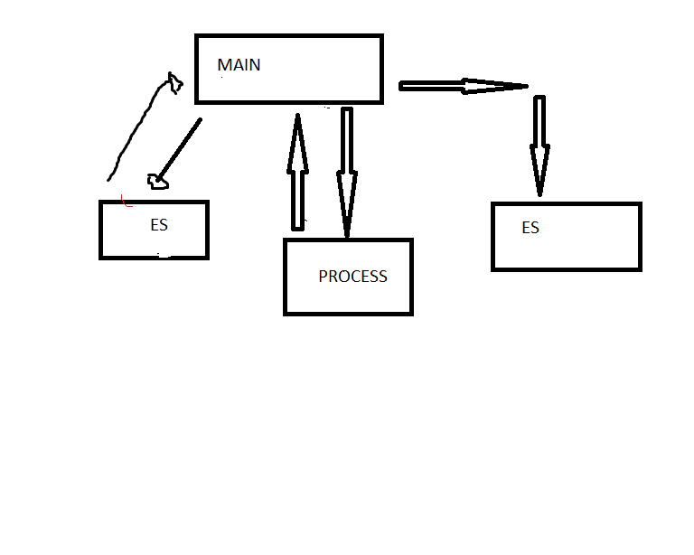

# Projeto de Arquitetura

Módulo de entrada de dados, processamento dos dados, para após retornar a saída.

Uma função impressora que imprime na tela o objeto.

Modelo de processamento: Receberá as coordenadas e determinará a função que passa por esses pontos, após isso deve ser plotado o gráfico.

